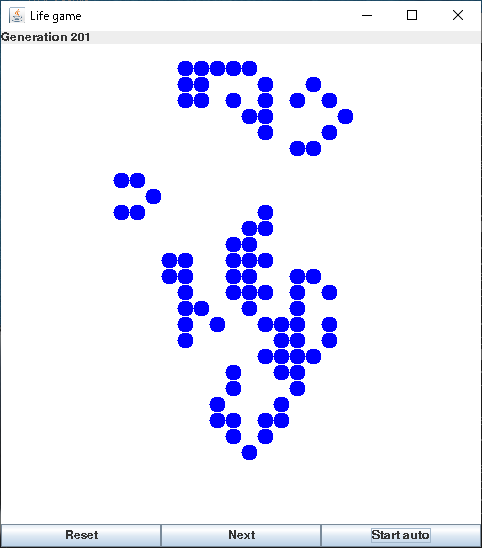

# SgSwing

## OVERVIEW
'SgSwing'は，SangoプログラムからJava Swingを利用する機能です。現在，初期開発中です。

## LICENSE
MIT License

## REQUIREMENTS
Sango 1.1 or higher  
Java 1.8 or higher

## DOCUMENTS
src/doc/*

## SAMPLE IMAGES

## SAMPLE CODE
(coming soon)
